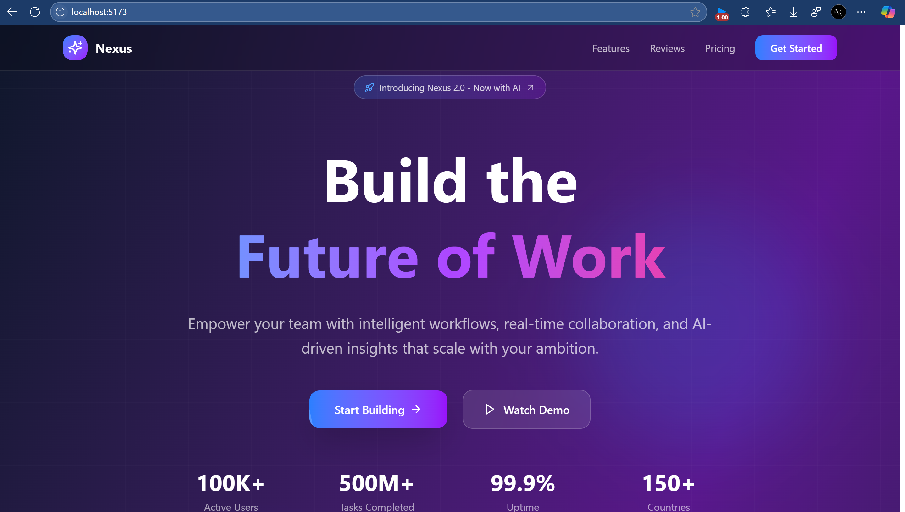
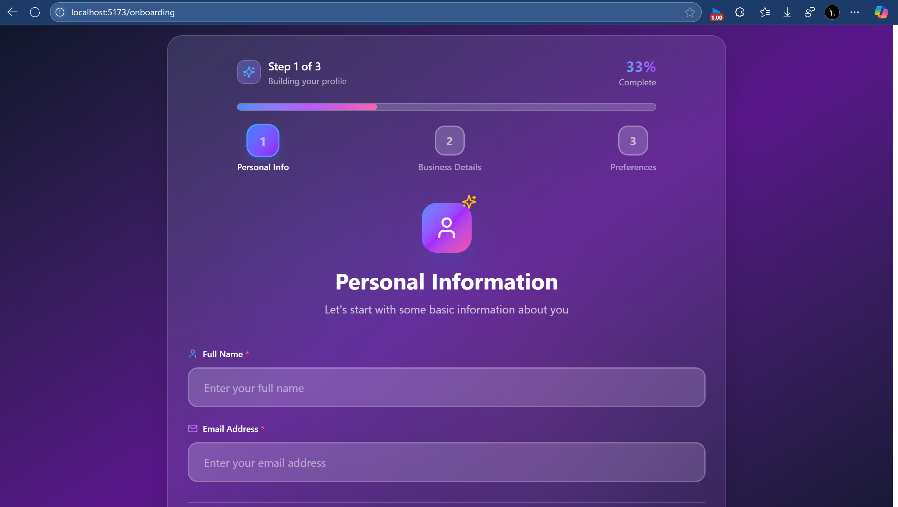
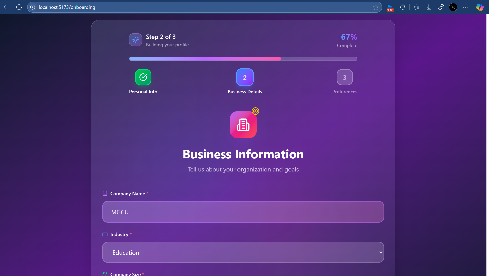
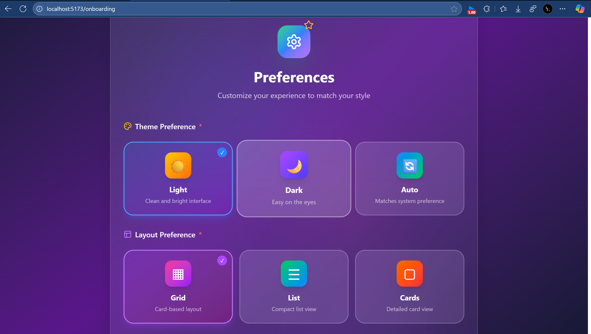
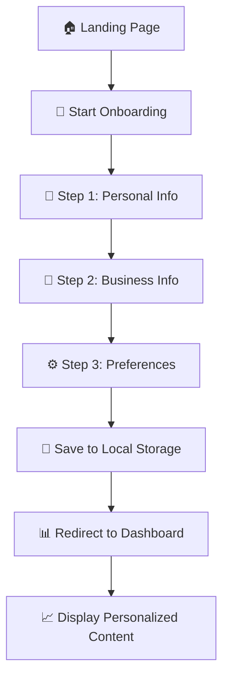

<div align="center">

# 🚀 Frontend Project

### A modern, responsive React application with TypeScript

[](https://reactjs.org/)
[](https://www.typescriptlang.org/)
[](https://vitejs.dev/)
[](https://tailwindcss.com/)

---

_An interactive onboarding wizard and dashboard showcasing advanced UI/UX patterns with smooth animations and beautiful, modern design._

[🎯 Live Demo](#) • [📖 Documentation](#) • [� Report Bug](#) • [💡 Request Feature](#)

</div>

---

## ✨ Features

<table>
<tr>
<td>

### 🎨 **User Interface**

- Beautiful landing page with interactive elements
- Smooth animations powered by Framer Motion
- Fully responsive across all devices
- Modern gradient backgrounds
- Dark/Light theme support

</td>
<td>

### 🧭 **Navigation & Flow**

- Multi-step onboarding wizard
- Progress tracking and validation
- React Router for seamless navigation
- Smooth step transitions
- Interactive dashboard

</td>
</tr>
<tr>
<td>

### 🛠️ **Development**

- Full TypeScript implementation
- ESLint code quality enforcement
- Hot Module Replacement (HMR)
- Component-based architecture
- Custom React hooks

</td>
<td>

### 📊 **Data & Analytics**

- Interactive charts with Recharts
- Local storage data persistence
- Form validation with error handling
- Real-time metrics display
- Type-safe data structures

</td>
</tr>
</table>

## 🏗️ Tech Stack

<div align="center">

### Core Framework

[](https://reactjs.org/)
[](https://www.typescriptlang.org/)
[](https://vitejs.dev/)

### Styling & Animation

[](https://tailwindcss.com/)
[](https://www.framer.com/motion/)
[](https://lucide.dev/)

### Data & Routing

[](https://recharts.org/)
[](https://reactrouter.com/)
[](https://axios-http.com/)

### Development Tools

[](https://eslint.org/)
[](https://typescript-eslint.io/)

</div>

## � Project Architecture

```
📁 src/
├── 🎨 components/
│   ├── 🏠 LandingPage.tsx          # Hero section & feature showcase
│   ├── 📊 Dashboard/
│   │   └── Dashboard.tsx           # Analytics & metrics dashboard
│   └── 🚀 Onboarding/
│       ├── OnboardingWizard.tsx    # Main wizard orchestrator
│       ├── ProgressBar.tsx         # Visual progress indicator
│       ├── Step1.tsx              # 👤 Personal information
│       ├── Step2.tsx              # 🏢 Business information
│       └── Step3.tsx              # ⚙️ Preferences setup
├── 🪝 hooks/
│   └── useSwipe.ts                # 👆 Touch gesture handling
├── 📋 types/
│   ├── index.ts                   # 🌐 Global type definitions
│   └── onboarding.ts              # 📝 Onboarding interfaces
├── 🛠️ utils/
│   └── storage.ts                 # 💾 Local storage management
├── 🖼️ assets/                     # Static resources
├── ⚡ App.tsx                     # Main app & routing logic
└── 🎯 main.tsx                   # Application entry point
```

<details>
<summary><strong>🔍 Component Details</strong></summary>

### 🏠 Landing Page

- Interactive hero with mouse tracking
- Animated feature cards
- Smooth scroll navigation
- Call-to-action integration

### 🚀 Onboarding Wizard

- **Step 1**: Personal data collection
- **Step 2**: Business information gathering
- **Step 3**: Preference configuration
- Real-time validation & progress tracking

### 📊 Dashboard

- Key metrics visualization
- Interactive charts (Recharts)
- Activity timeline
- Quick actions panel

</details>

## � Quick Start

### Prerequisites

<table>
<tr>
<td align="center">

<br><strong>Node.js 18+</strong>
<br><a href="https://nodejs.org/">Download</a>
</td>
<td align="center">

<br><strong>npm/yarn</strong>
<br>Package Manager
</td>
<td align="center">

<br><strong>Git</strong>
<br><a href="https://git-scm.com/">Download</a>
</td>
</tr>
</table>

### ⚡ Installation

```bash
# 1️⃣ Clone the repository
git clone <repository-url>
cd frontend-test

# 2️⃣ Install dependencies
npm install

# 3️⃣ Start development server
npm run dev

# 4️⃣ Open in browser
# 🌐 http://localhost:5173
```

### 🔧 Development Scripts

| Command           | Description                  | Usage        |
| ----------------- | ---------------------------- | ------------ |
| `npm run dev`     | 🔥 Start dev server with HMR | Development  |
| `npm run build`   | 📦 Build for production      | Deployment   |
| `npm run preview` | 👀 Preview production build  | Testing      |
| `npm run lint`    | 🔍 Run ESLint checks         | Code quality |

<details>
<summary><strong>🛠️ Troubleshooting</strong></summary>

#### Common Issues & Solutions

**🔄 Dependency Issues**

```bash
rm -rf node_modules package-lock.json
npm install
```

**⚡ Vite Cache Problems**

```bash
npx vite --clearCache
```

**📦 Node.js Version Check**

```bash
node --version  # Should be 18.0+
```

#### Development Features

- ⚡ **Hot Module Replacement** - Instant updates
- 🔄 **Fast Refresh** - Preserves component state
- 🚨 **Error Overlay** - In-browser error reporting
- 📝 **TypeScript Integration** - Real-time type checking

</details>

## 📸 Application Preview

<div align="center">

### 🏠 Landing Page



_Modern hero section with interactive elements and smooth animations_

---

### 🚀 Onboarding Experience

<table>
<tr>
<td align="center">

<br><strong>Step 1: Personal Info</strong>
<br><em>Data collection with validation</em>
</td>
<td align="center">

<br><strong>Step 2: Business Details</strong>
<br><em>Company information gathering</em>
</td>
<td align="center">

<br><strong>Step 3: Preferences</strong>
<br><em>Theme and layout configuration</em>
</td>
</tr>
</table>

---

### 📊 Interactive Dashboard


_Comprehensive analytics with charts, metrics, and real-time data_

</div>

## 🎯 Key Features Deep Dive

<details>
<summary><strong>🏠 Landing Page</strong></summary>

- 🎨 **Interactive Hero Section** - Mouse-tracking effects and dynamic backgrounds
- 📱 **Responsive Design** - Optimized for all screen sizes
- ⚡ **Performance Optimized** - Lazy loading and optimized assets
- 🎭 **Smooth Animations** - Framer Motion powered transitions
- 🔗 **Call-to-Action Integration** - Seamless onboarding flow initiation

</details>

<details>
<summary><strong>🚀 Onboarding Wizard</strong></summary>

- 📊 **Progress Tracking** - Visual progress bar with step indicators
- ✅ **Real-time Validation** - Form validation with error handling
- 💾 **Data Persistence** - Local storage for session recovery
- 🎨 **Smooth Transitions** - Animated step navigation
- 📱 **Touch Gestures** - Swipe support for mobile devices

</details>

<details>
<summary><strong>📊 Analytics Dashboard</strong></summary>

- 📈 **Interactive Charts** - Recharts integration with hover effects
- 📊 **Key Metrics Display** - Real-time data visualization
- 🔔 **Activity Timeline** - Recent user actions and notifications
- ⚡ **Quick Actions** - One-click navigation to common tasks
- 🎨 **Customizable Layout** - User preference based dashboard arrangement

</details>

## 🎨 Design System

| Element           | Implementation   | Features                                     |
| ----------------- | ---------------- | -------------------------------------------- |
| **🎨 Colors**     | Tailwind CSS     | Custom gradient backgrounds, theme variables |
| **✨ Animations** | Framer Motion    | Smooth transitions, micro-interactions       |
| **📱 Responsive** | CSS Grid/Flexbox | Mobile-first approach, breakpoint system     |
| **🎭 Icons**      | Lucide React     | 1000+ consistent icons, customizable         |
| **📝 Typography** | Inter Font       | Professional hierarchy, readable scales      |

## ⚙️ Configuration Files

| File                 | Purpose             | Key Features                       |
| -------------------- | ------------------- | ---------------------------------- |
| `vite.config.ts`     | Build configuration | HMR, plugins, optimization         |
| `tsconfig.json`      | TypeScript settings | Strict typing, path mapping        |
| `eslint.config.js`   | Code quality rules  | TypeScript support, best practices |
| `tailwind.config.js` | CSS framework setup | Custom themes, responsive design   |

## 🚀 Deployment & Production

### 📦 Build Process

```bash
# Create optimized production build
npm run build

# Preview production build locally
npm run preview
```

The build process:

- ⚡ **Vite Optimization** - Code splitting, tree shaking
- 🗜️ **Asset Compression** - Minification, gzip compression
- 📊 **Bundle Analysis** - Optimized chunk sizes
- 🔒 **Type Checking** - Full TypeScript validation

### 🌐 Deployment Options

<table>
<tr>
<td align="center">
<strong>Vercel</strong><br>
<code>npm i -g vercel</code><br>
<code>vercel --prod</code>
</td>
<td align="center">
<strong>Netlify</strong><br>
Drag & drop <code>dist/</code><br>
or connect Git repo
</td>
<td align="center">
<strong>GitHub Pages</strong><br>
<code>npm run build</code><br>
Upload <code>dist/</code> folder
</td>
</tr>
</table>

### 🔄 Application Flow



## 🤝 Contributing

We welcome contributions! Here's how to get started:

### 🛠️ Development Workflow

```bash
# 1️⃣ Fork & clone
git clone https://github.com/yourusername/frontend-test.git
cd frontend-test

# 2️⃣ Create feature branch
git checkout -b feature/amazing-feature

# 3️⃣ Make changes & commit
git commit -m "✨ Add amazing feature"

# 4️⃣ Push & create PR
git push origin feature/amazing-feature
```

### 📋 Contribution Guidelines

- 🧪 **Testing** - Ensure all features work as expected
- � **Documentation** - Update README for new features
- 🎨 **Code Style** - Follow ESLint rules and conventions
- 🔄 **Atomic Commits** - One feature per commit with clear messages

### 🏷️ Commit Convention

```
✨ feat: add new feature
🐛 fix: bug fixes
📝 docs: documentation updates
🎨 style: code formatting
♻️ refactor: code refactoring
🧪 test: adding tests
⚡ perf: performance improvements
```

## 📞 Support & Community

<div align="center">

### 💬 Get Help

[](../../issues)
[](../../discussions)

### 👨‍💻 Developer Contact

For direct inquiries, suggestions, or collaboration opportunities:

[](mailto:mintu12890551@gmail.com)

### 🌟 Show Your Support

If this project helped you, please consider giving it a ⭐ on GitHub!

[](https://star-history.com/#yourusername/frontend-test&Date)

</div>

---

<div align="center">

**Built with ❤️ using React, TypeScript, and modern web technologies**

[](https://reactjs.org/)
[](https://www.typescriptlang.org/)
[](https://vitejs.dev/)

</div>
