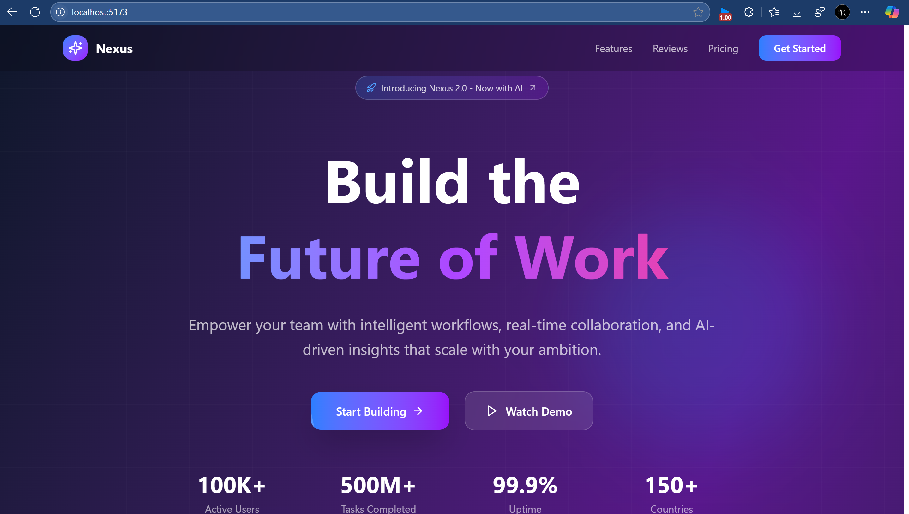
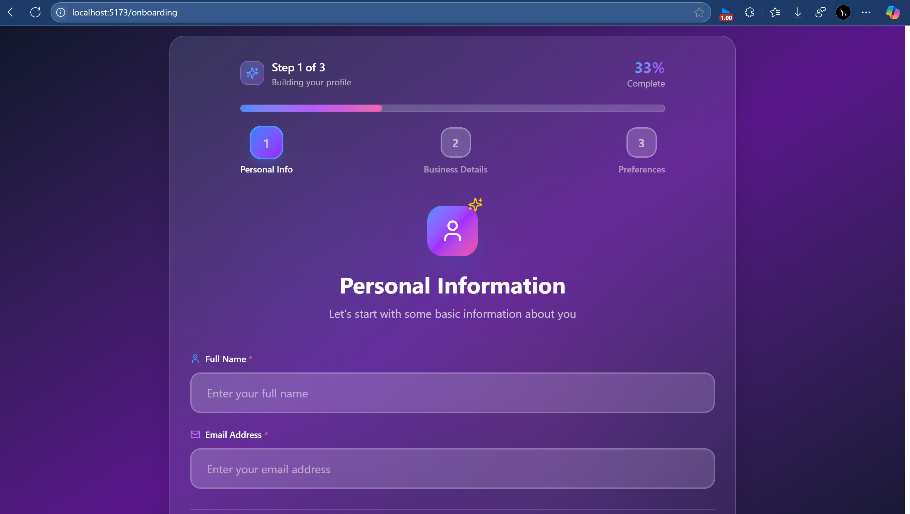
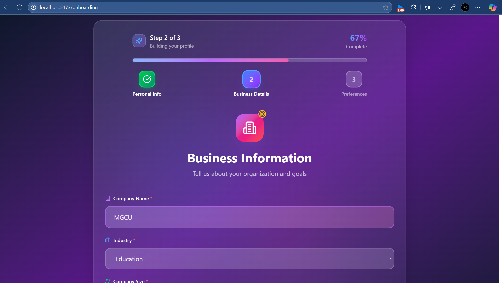
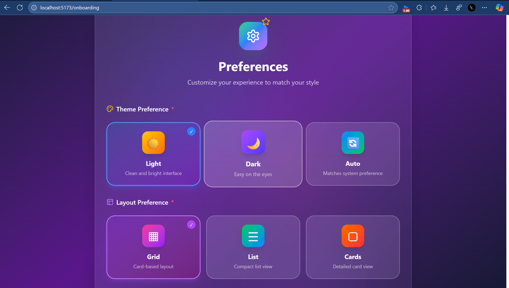
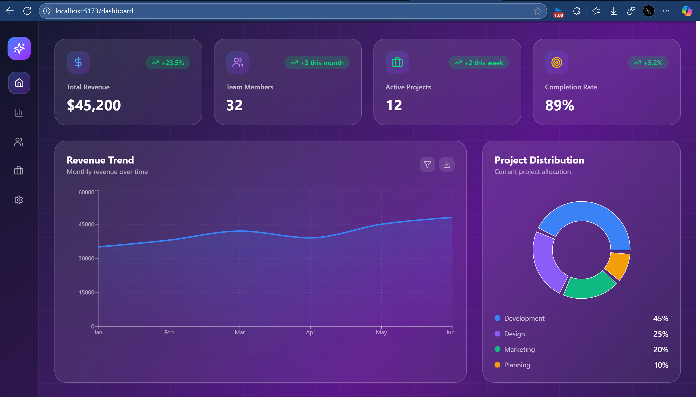

# Frontend Project

A modern, responsive React application built with TypeScript, featuring an interactive onboarding wizard and dashboard. This project demonstrates advanced UI/UX patterns with smooth animations and a beautiful, modern design.

## 🚀 Features

- **Beautiful Landing Page** - Eye-catching hero section with interactive elements and smooth animations
- **Multi-Step Onboarding Wizard** - Guided user setup with progress tracking and form validation
- **Interactive Dashboard** - Comprehensive analytics dashboard with charts and metrics
- **Responsive Design** - Fully responsive across all device sizes
- **Modern UI/UX** - Built with Tailwind CSS and Framer Motion for smooth animations
- **Type Safety** - Full TypeScript implementation for better development experience
- **Routing** - React Router for seamless navigation between pages

## 🛠️ Tech Stack

### Core Technologies

- **React 19.1.0** - Latest React with concurrent features and improved performance
- **TypeScript 5.8.3** - Type-safe JavaScript with enhanced developer experience
- **Vite 6.3.5** - Lightning-fast build tool and development server

### Styling & UI

- **Tailwind CSS 4.1.8** - Utility-first CSS framework for rapid UI development
- **Framer Motion 12.16.0** - Production-ready motion library for React animations
- **Lucide React 0.513.0** - Beautiful & consistent icon library with 1000+ icons

### Data Visualization

- **Recharts 2.15.3** - Composable charting library built on React components

### Routing & Navigation

- **React Router DOM 7.6.2** - Declarative routing for React applications

### HTTP & API

- **Axios 1.9.0** - Promise-based HTTP client for API requests

### Development Tools

- **ESLint 9.25.0** - Code linting with TypeScript support
- **Vite Plugin React 4.4.1** - Fast refresh and optimized React development
- **TypeScript ESLint 8.30.1** - TypeScript-specific linting rules

### Build & Bundling

- **Vite** - Module bundler with HMR (Hot Module Replacement)
- **TypeScript Compiler** - Transpilation and type checking
- **ESBuild** - Ultra-fast JavaScript bundler (via Vite)

## 📁 Project Structure

```
src/
├── components/
│   ├── LandingPage.tsx          # Main landing page component
│   ├── Dashboard/
│   │   └── Dashboard.tsx        # Analytics dashboard
│   └── Onboarding/
│       ├── OnboardingWizard.tsx # Main wizard component
│       ├── ProgressBar.tsx      # Progress indicator
│       ├── Step1.tsx           # Personal information step
│       ├── Step2.tsx           # Business information step
│       ├── Step3.tsx           # Preferences and completion
│       └── Step3_new.tsx       # Alternative step 3 implementation
├── hooks/
│   └── useSwipe.ts             # Custom swipe gesture hook
├── types/
│   ├── index.ts                # Global type definitions
│   └── onboarding.ts           # Onboarding-specific types
├── utils/
│   └── storage.ts              # Local storage utilities
├── assets/                     # Static assets
├── App.tsx                     # Main app component with routing
├── AppRoutes.tsx              # Route definitions
├── main.tsx                   # Application entry point
└── index.css                  # Global styles
```

## 🚦 Getting Started

### Prerequisites

Make sure you have the following installed on your machine:

- **Node.js** (version 18.0 or higher) - [Download here](https://nodejs.org/)
- **npm** (comes with Node.js) or **yarn** package manager
- **Git** for version control

You can verify your installations by running:

```bash
node --version  # Should be 18.0 or higher
npm --version   # Should be 9.0 or higher
git --version   # Any recent version
```

### Installation & Setup

Follow these steps to get the project running locally:

1. **Clone the repository**

   ```bash
   git clone <repository-url>
   cd frontend
   ```

2. **Install dependencies**

   ```bash
   # Using npm (recommended)
   npm install

   # Or using yarn
   yarn install
   ```

3. **Start the development server**

   ```bash
   # Using npm
   npm run dev

   # Or using yarn
   yarn dev
   ```

4. **Open your browser**
   - Navigate to `http://localhost:5173` to view the application
   - The development server will automatically reload when you make changes

### Development Server Features

- **Hot Module Replacement (HMR)** - Instant updates without losing component state
- **Fast Refresh** - Preserves React component state across edits
- **Error Overlay** - In-browser error reporting with stack traces
- **TypeScript Integration** - Real-time type checking and IntelliSense

### Environment Setup (Optional)

Create a `.env` file in the root directory if you need environment variables:

```bash
# .env
VITE_API_BASE_URL=http://localhost:3000/api
VITE_APP_TITLE=Frontend Project
```

### Troubleshooting

If you encounter issues:

1. **Clear node_modules and reinstall**:

   ```bash
   rm -rf node_modules package-lock.json
   npm install
   ```

2. **Clear Vite cache**:

   ```bash
   npx vite --clearCache
   ```

3. **Check Node.js version**:
   ```bash
   node --version
   # Update Node.js if below version 18
   ```

## 📜 Available Scripts

- `npm run dev` - Start the development server with hot reload
- `npm run build` - Build the application for production
- `npm run preview` - Preview the production build locally
- `npm run lint` - Run ESLint to check code quality

## 📸 Screenshots

### Landing Page


_Modern landing page with interactive hero section and feature showcase_

### Onboarding Wizard - Step 1


_Personal information collection with smooth animations_

### Onboarding Wizard - Step 2


_Business information gathering with form validation_

### Onboarding Wizard - Step 3


_Preferences setup with theme and layout options_

### Dashboard


_Interactive analytics dashboard with charts and metrics_

## 🎯 Key Components

### Landing Page

- Interactive hero section with mouse-tracking effects
- Feature showcase with animated cards
- Call-to-action buttons leading to onboarding

### Onboarding Wizard

- **Step 1**: Personal information collection (name, email)
- **Step 2**: Business information (company details, industry)
- **Step 3**: Preferences setup (theme, dashboard layout)
- Progress tracking and validation
- Smooth step transitions with animations

### Dashboard

- Analytics overview with key metrics
- Interactive charts using Recharts
- Recent activities and notifications
- Quick action buttons and navigation

## 🎨 Design Features

- **Modern Gradient Backgrounds** - Beautiful color transitions
- **Smooth Animations** - Powered by Framer Motion
- **Interactive Elements** - Hover effects and micro-interactions
- **Responsive Grid Layouts** - Adapts to all screen sizes
- **Consistent Typography** - Professional font hierarchy
- **Dark/Light Theme Support** - User preference-based theming

## 🔧 Configuration

The project uses several configuration files:

- `vite.config.ts` - Vite bundler configuration
- `tsconfig.json` - TypeScript compiler options
- `eslint.config.js` - Code linting rules
- `tailwind.config.js` - Tailwind CSS customization (if present)

## 💾 Data Management

- **Local Storage**: User onboarding data persistence
- **Type Safety**: Full TypeScript interfaces for data structures
- **Validation**: Form validation with error handling
- **State Management**: React hooks for component state

## 🚀 Deployment

To build for production:

```bash
npm run build
```

This creates an optimized build in the `dist` folder, ready for deployment to any static hosting service.

## 🔄 Development Workflow

1. The application starts with a landing page
2. Users can begin onboarding through the wizard
3. Onboarding data is saved to local storage
4. Upon completion, users are redirected to the dashboard
5. Dashboard displays personalized content based on onboarding data

## 🤝 Contributing

1. Fork the repository
2. Create a feature branch (`git checkout -b feature/amazing-feature`)
3. Commit your changes (`git commit -m 'Add some amazing feature'`)
4. Push to the branch (`git push origin feature/amazing-feature`)
5. Open a Pull Request

## 🙋‍♂️ Support

If you have any questions or need help with the project, please create an issue in the repository or contact the development team.

---

Built with ❤️ using React, TypeScript, and modern web technologies.
